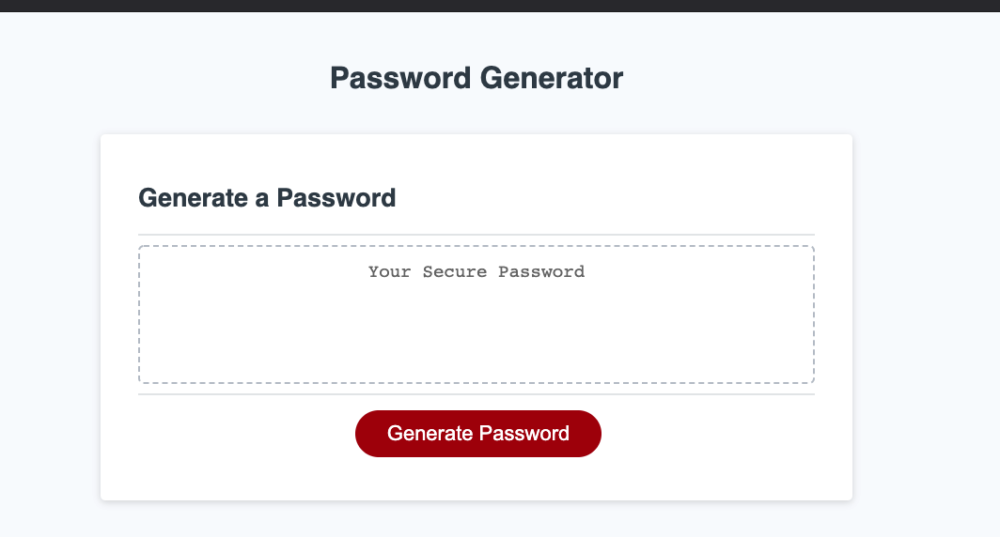
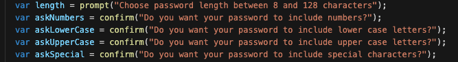
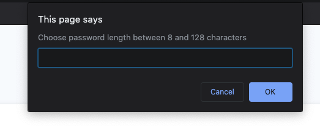
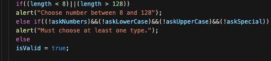

# Assignment3JavaScript
03 JavaScript: Password Generator

## Live Link

https://marykathryn0.github.io/Assignment3JavaScript/

## Goal

The client frquently has to access sensitive data and would 
like to ensure high level of security. They would like an 
application that randomly generates a password based on defined 
criteria ensuring strong security.

## Scope of Work

1. User will click the button to generate a password

2. After clicking the user will be prompted with questions 
regarding a. criteria & b. options for password:
- **Criteria:** 
- Must be between 8 and 128 characters long
- Must choose at least 1 of the character options:
  - numbers 
  - lower case letter 
  - upper case letter 
  - and/or special character
- **Options:**
- User chooses length of PW within the criteria
- User can choose which/some/or all of the PW character choices:
    (must include at least 1 option per criteria above)
  - numbers 
  - lower case letter 
  - upper case letter 
  - special character

3. Upon answering the prompts the password will generate and appear in the box. 

## Requirements Met Thru the Following:

1. Kept look of original website:

2. Prompted user with questions to determine user choices:

3. Ensured that criteria to ensure strong password was met:         

4. Generated secure password for user:

## Credits

Edited by Mary Kathryn Holt; https://github.com/MaryKathryn0.
Content provided by: https://github.com/the-Coding-Boot-Camp-at-UT/UTA-AUS-FSF-FT-09-2020-U-C/

/Users/marykathryn/Desktop/Assignment3JavaScript/images/OriginalSite.png

